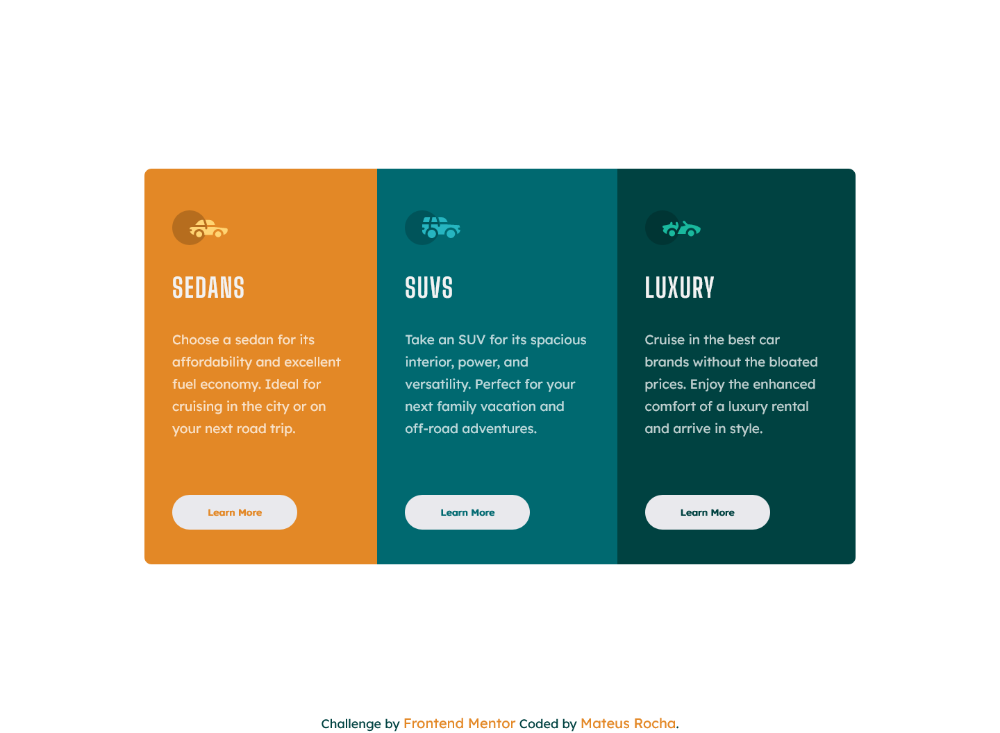

# Frontend Mentor - 3-column preview card component solution

Hello 👋 

This is a solution to the [3-column preview card component challenge on Frontend Mentor](https://www.frontendmentor.io/challenges/3column-preview-card-component-pH92eAR2-). Frontend Mentor challenges help you improve your coding skills by building realistic projects. 

## Table of contents

  - [Overview](#overview) 
  - [Screenshot](#screenshot)
  - [Links](#links)
  - [Built with](#built-with)
  - [Useful resources](#useful-resources)
  - [Author](#author)

## Overview

On this challenge I tried to apply CSS variables.

Improvement suggestion are welcomed!

### Screenshot

### Links 

[Live Site](https://mateus-lr.github.io/3-column-preview-card-component/)

### Built with

- Semantic HTML5 markup
- CSS custom properties
- Mobile-first workflow
- Responsive CSS
- Flexbox
- :hover selector
- media queries
- CSS Variables

### Useful resources

- [:hover Selector](https://www.w3schools.com/cssref/sel_hover.asp)
- [Media Queries](https://developer.mozilla.org/pt-BR/docs/Web/CSS/Media_Queries/Using_media_queries)
- [CSS Variables](https://www.w3schools.com/css/css3_variables.asp)

## Author

- Website - [Mateus Rocha](https://github.com/mateus-lr)
- Frontend Mentor - [@mateus-lr](https://www.frontendmentor.io/profile/mateus-lr)
- Twitter - [@matscript](https://www.twitter.com/maatscript)
